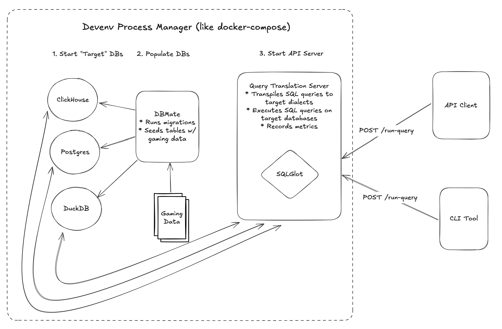

# Greybeam

A simple sql transpilation + execution service. Given a sql query and the corresponding sql dialect, this project will transpile the input query into several target databases' dialects and execute them.

https://excalidraw.com/#json=BIxlxhtGtaK1xnIHpOH1y,laCA7RfwmgTSjmwMffNkTQ

See .docs/ for setup instructions and more:
- [Setup](./docs/setup.md)
- [Notes](./docs/notes.md)

## Setup

See [Setup](./docs/setup.md) for instructions.

## Notes

For more comprehensive details on assumptions and design decisions, see [Notes](./docs/notes.md).

### Assumptions

1. Only SELECT queries
2. Input query is valid sql, understandable by sqlglot, and matches the seeded CH and PG tables
3. Fine with SQL Injection-as-a-Service

### What Would I Do With More Time

1. Fix occasional bug requiring `rm -rf .devenv/state/postgres/ .devenv/state/clickhouse/` to clean up databases
2. Pull hardcoded db credentials out of application code into config
3. Record 'POST /run-query' requests in a database (probably clickhouse for analytics)
4. Compare result sets and alert on differences
5. Create a `Dockerfile` for nix-less setup
6. Generate database documentation with `tbls`
7. Tweak `uv` project structure so server could be started with `uv run greybeam` or `uv run server`
8. OTel for metrics and observability
