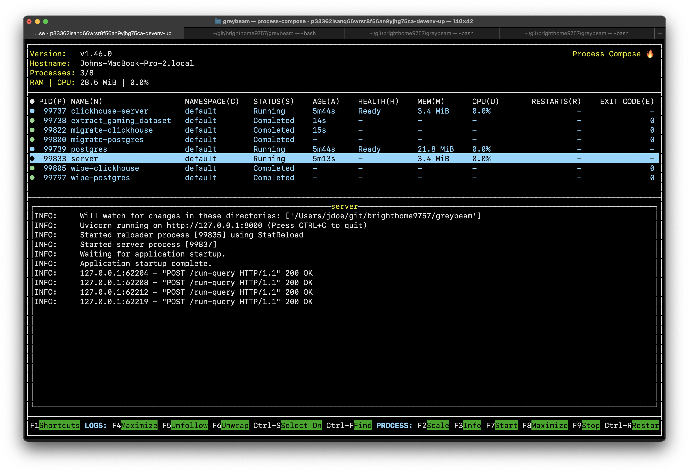

# Setup 

ATTENTION: Before starting, please download the ["Gaming Profiles 2025" dataset](https://www.kaggle.com/datasets/artyomkruglov/gaming-profiles-2025-steam-playstation-xbox/data) dataset. Place the resulting `archive.zip` in the `assets/` directory.

---

I have only tested on an ARM MacOS laptop.

This setup requires the Nix package manager. Follow the first two steps in the "Installation" section on devenv.sh to get set up: https://devenv.sh/getting-started/

If you have nix and direnv installed, enter the repository and allow direnv to start.

```bash
$ cd greybeam
$ direnv allow
```

This will trigger a nix build and download all of the necessary dependencies.

In one terminal, you can use `devenv` to start up local ClickHouse and Postgres servers, extract the ["Gaming Profiles 2025" dataset](https://www.kaggle.com/datasets/artyomkruglov/gaming-profiles-2025-steam-playstation-xbox/data) archive, run migrations, seed the databases, and a launch the sql transpilation server. This command will render a TUI for devenv's process manager (process-compose):

```bash
$ clean-dbs
Cleaning up database state directories...
Database state directories cleaned. Fresh databases will be initialized.

$ devenv up
```

This may take up to 60 seconds in whole. You can proceed once the "server" process has a "Running" status:


The server is now ready to accept requests against `gaming` and `prices` tables. 

In a separate terminal, try a request with curl:

```bash
curl -H 'Content-Type: application/json' \
  -X POST 'localhost:8000/run-query' \
  --data '{"query": "SELECT platform, COUNT(*) FROM games GROUP BY platform", "dialect": "duckdb"}' | jq .
```

Or use one of the example requests in `bin/`:

```bash
$ tree bin/
bin/
├── run_example_1.sh
├── run_example_2.sh
├── run_example_3.sh
└── start_server.sh

$ ./bin/run_example_2.sh 
  % Total    % Received % Xferd  Average Speed   Time    Time     Time  Current
                                 Dload  Upload   Total   Spent    Left  Speed
100   633  100   538  100    95  17866   3154 --:--:-- --:--:-- --:--:-- 21100
{
  "clickhouse": {
    "transpiled_sql": "select distinct gameid, title from games where gameid < 3",
    "transpilation_time_ms": 0,
    "execution_time_ms": 8,
    "row_count": 2,
    "results_sample": [
      {
        "gameid": 1,
        "title": "Deus Ex: Human Revolution"
      },
      {
        "gameid": 2,
        "title": "God of War III"
      }
    ]
  },
  "postgres": {
    "transpiled_sql": "SELECT DISTINCT gameid, title FROM games WHERE gameid < 3",
    "transpilation_time_ms": 10,
    "execution_time_ms": 2,
    "row_count": 2,
    "results_sample": [
      {
        "gameid": 2,
        "title": "God of War III"
      },
      {
        "gameid": 1,
        "title": "Deus Ex: Human Revolution"
      }
    ],
    "fetch_time_ms": 2
  }
}
```

# Debugging

If you run into issues with postgres or clickhouse, stop the servers and run the following before restarting:

```bash
$ rm -rf .devenv/state/postgres/ .devenv/state/clickhouse/
```

OR

```bash
$ clean-dbs
```

This will remove any previous database state so that new ones can be created from scratch.